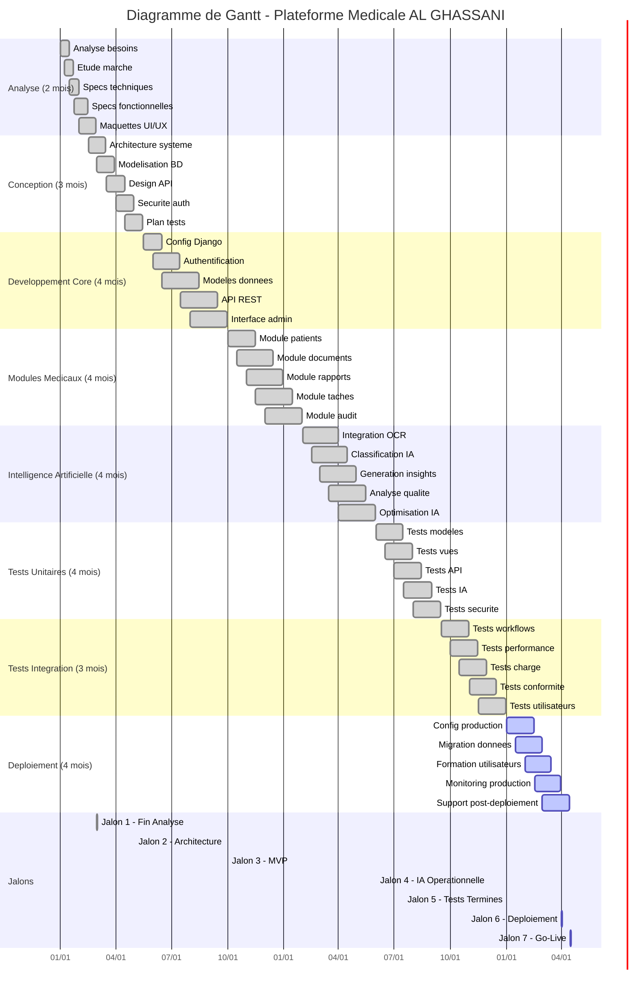

## **Diagramme de Gantt - Plateforme Médicale AL GHASSANI**

### **Vue d'ensemble du projet**

Planification complète du développement de la plateforme médicale **AL GHASSANI** sur **18 mois** avec **8 phases principales** et **7 jalons critiques**.

---

## **PHASES DU PROJET**

### **Analyse (Jan-Fév 2024)**
- Analyse des besoins et spécifications
- Etude de marché médicale
- Maquettes UI/UX

### **Conception (Mar-Mai 2024)**
- Architecture système Django
- Modélisation base de données
- Design API REST et sécurité

### **Développement Core (Jun-Sep 2024)**
- Configuration framework Django
- Système authentification et permissions
- API REST et interface administration

### **Modules Médicaux (Oct-Jan 2025)**
- Module patients (dossiers médicaux)
- Module documents (OCR, classification)
- Module rapports (validation, export)
- Module tâches (planning, suivi)
- Module audit (traçabilité)

### **Intelligence Artificielle (Fév-Mai 2025)**
- Intégration OCR automatique
- Classification IA documents
- Génération insights médicaux
- Analyse qualité et optimisation

### **Tests Unitaires (Jun-Sep 2025)**
- Tests modèles, vues, API
- Tests IA et sécurité
- Couverture 100% du code

### **Tests Intégration (Oct-Déc 2025)**
- Tests workflows complets
- Tests performance et charge
- Tests conformité médicale
- Tests utilisateurs finaux

### **Déploiement (Jan-Avr 2026)**
- Configuration environnement production
- Migration données
- Formation utilisateurs
- Monitoring et support

---

## **JALONS CRITIQUES**

1. **Fin Analyse** (01/03/2024) - Validation besoins
2. **Architecture Validée** (01/05/2024) - Approbation technique
3. **MVP Fonctionnel** (01/10/2024) - Version utilisable
4. **IA Opérationnelle** (01/06/2025) - IA active
5. **Tests Terminés** (01/01/2026) - Validation complète
6. **Déploiement Production** (01/04/2026) - Mise en service
7. **Go-Live** (16/04/2026) - Lancement officiel

---

## **DÉPENDANCES**

```
Analyse → Conception → Développement → Tests → Déploiement
   ↓         ↓            ↓           ↓        ↓
Maquettes → Architecture → Core → Modules → IA → Tests → Production
```

---

## **MÉTRIQUES**

- **Durée totale** : 18 mois
- **Budget** : Développement 45%, Infrastructure 25%
- **Équipe** : 5-8 personnes (PM, Architecte, Développeurs, QA)
- **Performance** : 99.9% uptime, <2s temps réponse
- **Conformité** : RGPD, HIPAA, audit trail complet

---

**Planification complète du projet médical avec IA !**
