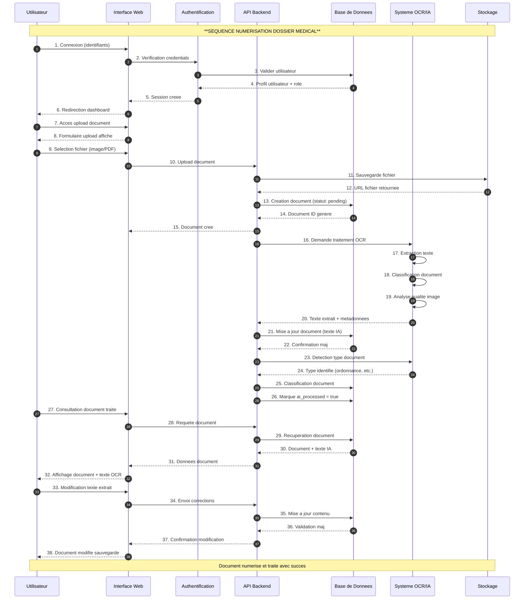

```mermaid
sequenceDiagram
    autonumber
    participant U as Utilisateur
    participant Web as Interface Web
    participant Auth as Authentification
    participant API as API Backend
    participant DB as Base de Donnees
    participant OCR as Systeme OCR/IA
    participant Storage as Stockage

    Note over U,Storage: **SEQUENCE NUMERISATION DOSSIER MEDICAL**

    %% Authentification
    U->>Web: 1. Connexion (identifiants)
    Web->>Auth: 2. Verification credentials
    Auth->>DB: 3. Valider utilisateur
    DB-->>Auth: 4. Profil utilisateur + role
    Auth-->>Web: 5. Session creee
    Web-->>U: 6. Redirection dashboard

    %% Upload document
    U->>Web: 7. Acces upload document
    Web-->>U: 8. Formulaire upload affiche
    U->>Web: 9. Selection fichier (image/PDF)
    Web->>API: 10. Upload document
    API->>Storage: 11. Sauvegarde fichier
    Storage-->>API: 12. URL fichier retournee
    API->>DB: 13. Creation document (statut: pending)
    DB-->>API: 14. Document ID genere
    API-->>Web: 15. Document cree

    %% Traitement OCR/IA
    API->>OCR: 16. Demande traitement OCR
    OCR->>OCR: 17. Extraction texte
    OCR->>OCR: 18. Classification document
    OCR->>OCR: 19. Analyse qualite image
    OCR-->>API: 20. Texte extrait + metadonnees
    API->>DB: 21. Mise a jour document (texte IA)
    DB-->>API: 22. Confirmation maj
    API->>OCR: 23. Detection type document
    OCR-->>API: 24. Type identifie (ordonnance, etc.)
    API->>DB: 25. Classification document
    API->>DB: 26. Marque ai_processed = true

    %% Visualisation
    U->>Web: 27. Consultation document traite
    Web->>API: 28. Requete document
    API->>DB: 29. Recuperation document
    DB-->>API: 30. Document + texte IA
    API-->>Web: 31. Donnees document
    Web-->>U: 32. Affichage document + texte OCR

    %% Modification si necessaire
    U->>Web: 33. Modification texte extrait
    Web->>API: 34. Envoi corrections
    API->>DB: 35. Mise a jour contenu
    DB-->>API: 36. Validation maj
    API-->>Web: 37. Confirmation modification
    Web-->>U: 38. Document modifie sauvegarde

    Note over U,Storage: Document numerise et traite avec succes
```

