# Diagramme de Cas d'Utilisation - Admin (Corrigé)

```mermaid
graph LR
    %% Acteurs
    Admin([Admin])
    SystemEmail([Système Email])
    
    %% === GESTION AUTHENTIFICATION ===
    subgraph Auth["Gestion Authentification"]
        style Auth fill:#ffffff,stroke:#333,stroke-width:2px
        UC_Login[Connexion]
    end
    
    %% === GESTION DES UTILISATEURS ===
    subgraph Users["Gestion des Utilisateurs"]
        style Users fill:#ffffff,stroke:#333,stroke-width:2px
        UC_UserMgmt[Gestion des utilisateurs]
        UC_CreateUser[Créer un utilisateur]
        UC_ModifyUser[Modifier un utilisateur]
        UC_ViewUser[Visualiser un utilisateur]
        UC_DeleteUser[Supprimer un utilisateur]
        UC_ModifyRole[Modifier le rôle]
        UC_ValidateAccount[Valider un compte]
        UC_RejectAccount[Rejeter un compte]
    end
    
    %% === GESTION DES PATIENTS ===
    subgraph Patients["Gestion des Patients"]
        style Patients fill:#ffffff,stroke:#333,stroke-width:2px
        UC_PatientMgmt[Gestion des patients]
        UC_CreatePatient[Créer un patient]
        UC_ModifyPatient[Modifier un patient]
        UC_ViewPatient[Visualiser un patient]
        UC_DeletePatient[Supprimer un patient]
    end
    
    %% === GESTION DES DOCUMENTS ===
    subgraph Documents["Gestion des Documents"]
        style Documents fill:#ffffff,stroke:#333,stroke-width:2px
        UC_DocMgmt[Gestion des documents]
        UC_CreateDoc[Créer un document]
        UC_ScanDoc[Numériser un document]
        UC_TreatDocIA[Traiter avec IA]
        UC_ModifyDoc[Modifier un document]
        UC_ViewDoc[Visualiser un document]
        UC_DeleteDoc[Supprimer un document]
    end
    
    %% === GESTION DES RAPPORTS ===
    subgraph Reports["Gestion des Rapports"]
        style Reports fill:#ffffff,stroke:#333,stroke-width:2px
        UC_ReportMgmt[Gestion des rapports]
        UC_CreateReport[Créer un rapport]
        UC_ModifyReport[Modifier un rapport]
        UC_ViewReport[Visualiser un rapport]
        UC_DeleteReport[Supprimer un rapport]
        UC_ValidateReport[Valider ou rejeter un rapport]
    end
    
    %% === GESTION DES SYSTÈMES ===
    subgraph Systems["Gestion des Systèmes"]
        style Systems fill:#ffffff,stroke:#333,stroke-width:2px
        UC_SystemMgmt[Gestion des systèmes]
        UC_ConfigureSystem[Configurer le système]
        UC_ViewLogs[Consulter les logs]
        UC_ManageBackups[Gérer les sauvegardes]
        UC_AuditSystem[Auditer le système]
    end
    
    %% === GESTION COFFRE-FORT ===
    subgraph Vault["Coffre-fort des Suppressions"]
        style Vault fill:#ffffff,stroke:#333,stroke-width:2px
        UC_VaultMgmt[Gestion du coffre-fort]
        UC_ViewDeleted[Consulter éléments supprimés]
        UC_RestoreItem[Restaurer un élément]
        UC_PermanentDelete[Supprimer définitivement]
    end
    
    %% Relations Admin
    Admin --> UC_Login
    Admin --> UC_UserMgmt
    Admin --> UC_PatientMgmt
    Admin --> UC_DocMgmt
    Admin --> UC_ReportMgmt
    Admin --> UC_SystemMgmt
    Admin --> UC_VaultMgmt
    
    %% Relations Système Email
    SystemEmail --> UC_ReportMgmt
    
    %% Relations internes - Utilisateurs (MÉDECINS + INFIRMIERS INCLUS)
    UC_Login -.->|include| UC_UserMgmt
    UC_CreateUser -.->|extend| UC_UserMgmt
    UC_ModifyUser -.->|extend| UC_UserMgmt
    UC_ViewUser -.->|extend| UC_UserMgmt
    UC_DeleteUser -.->|extend| UC_UserMgmt
    UC_ValidateAccount -.->|extend| UC_UserMgmt
    UC_RejectAccount -.->|extend| UC_UserMgmt
    UC_ModifyRole -.->|extend| UC_UserMgmt
    
    %% Relations internes - Patients
    UC_CreatePatient -.->|extend| UC_PatientMgmt
    UC_ModifyPatient -.->|extend| UC_PatientMgmt
    UC_ViewPatient -.->|extend| UC_PatientMgmt
    UC_DeletePatient -.->|extend| UC_PatientMgmt
    
    %% Relations internes - Documents
    UC_Login -.->|include| UC_DocMgmt
    UC_CreateDoc -.->|extend| UC_DocMgmt
    UC_ScanDoc -.->|extend| UC_DocMgmt
    UC_ScanDoc -.->|include| UC_CreateDoc
    UC_TreatDocIA -.->|include| UC_CreateDoc
    UC_ModifyDoc -.->|extend| UC_DocMgmt
    UC_ViewDoc -.->|extend| UC_DocMgmt
    UC_DeleteDoc -.->|extend| UC_DocMgmt
    
    %% Relations internes - Rapports
    UC_CreateReport -.->|extend| UC_ReportMgmt
    UC_ModifyReport -.->|extend| UC_ReportMgmt
    UC_ViewReport -.->|extend| UC_ReportMgmt
    UC_DeleteReport -.->|extend| UC_ReportMgmt
    UC_ValidateReport -.->|extend| UC_ReportMgmt
    
    %% Relations internes - Systèmes
    UC_ConfigureSystem -.->|extend| UC_SystemMgmt
    UC_ViewLogs -.->|extend| UC_SystemMgmt
    UC_ManageBackups -.->|extend| UC_SystemMgmt
    UC_AuditSystem -.->|extend| UC_SystemMgmt
    
    %% Relations internes - Coffre-fort
    UC_ViewDeleted -.->|extend| UC_VaultMgmt
    UC_RestoreItem -.->|extend| UC_VaultMgmt
    UC_PermanentDelete -.->|extend| UC_VaultMgmt
```

## Changements apportés

### ❌ **Supprimé** :
1. ~~Gestion des Médecins~~ (subgraph complet)
2. ~~Gestion des Infirmiers~~ (subgraph complet)

### ✅ **Modifié** :
- **Gestion des Utilisateurs** inclut maintenant :
  - Créer un utilisateur (médecin, infirmier, technicien, admin)
  - Modifier un utilisateur
  - Visualiser un utilisateur
  - Supprimer un utilisateur
  - Modifier le rôle
  - Valider/Rejeter un compte

### ✅ **Ajouté** :
- **Coffre-fort des Suppressions** (existant dans le code)
  - Consulter éléments supprimés
  - Restaurer un élément
  - Supprimer définitivement

## Correspondance avec le code

| Diagramme | Code (URLs) |
|-----------|-------------|
| Gestion des utilisateurs | `/users/` |
| Créer un utilisateur | POST `/users/` |
| Visualiser un utilisateur | `/users/<id>/` |
| Modifier un utilisateur | `/users/<id>/edit/` |
| Supprimer un utilisateur | `/users/<id>/delete/` |
| Gestion du coffre-fort | `/administration/deleted-items/` |
| Restaurer un élément | `/administration/restore/<code>/` |
| Supprimer définitivement | `/administration/permanent-delete/<code>/` |
