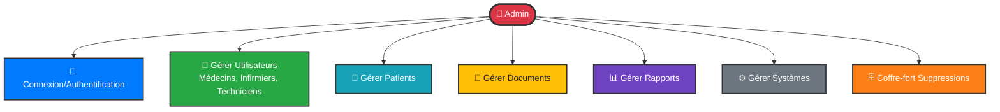

# Diagramme de Cas d'Utilisation - Admin (Version Simplifiée)

## Architecture simplifiée conforme au code

## Détails des fonctionnalités par module

### 👥 Gestion des Utilisateurs
**Route** : `/users/`

L'admin peut gérer **TOUS** les types d'utilisateurs dans une seule interface :
- ✅ Créer utilisateur (médecin, infirmier, technicien, admin)
- ✅ Modifier utilisateur
- ✅ Visualiser profil utilisateur
- ✅ Supprimer utilisateur
- ✅ Activer/Désactiver compte
- ✅ Modifier rôle

**✨ Changement important** : Plus de gestion séparée pour médecins et infirmiers !

### 🏥 Gestion des Patients
**Route** : `/patients/`
- Créer patient
- Modifier patient
- Visualiser dossier patient
- Supprimer patient

### 📄 Gestion des Documents
**Route** : `/documents/`
- Créer document
- Numériser document (Scanner)
- Traiter avec IA
- Modifier document
- Visualiser document
- Supprimer document

### 📊 Gestion des Rapports
**Route** : `/reports/`
- Créer rapport
- Modifier rapport
- Visualiser rapport
- Supprimer rapport
- Valider/Rejeter rapport

### ⚙️ Gestion des Systèmes
**Routes** : `/settings/`, `/system/*`
- Configurer système
- Consulter logs (`/system/logs/`)
- Gérer sauvegardes (`/system/backup/`)
- Monitoring (`/system/monitor/`)
- Maintenance (`/maintenance/`)

### 🗄️ Coffre-fort des Suppressions
**Route** : `/administration/deleted-items/`
- Consulter éléments supprimés
- Restaurer élément
- Supprimer définitivement

## Tableau de correspondance Code ↔ Diagramme

| Fonctionnalité Diagramme | URL dans le Code | Vue/Fonction |
|--------------------------|------------------|--------------|
| Gestion Utilisateurs | `/users/` | `users()` |
| Créer Utilisateur | POST `/users/` | `users()` POST |
| Voir Utilisateur | `/users/<id>/` | `view_user()` |
| Modifier Utilisateur | `/users/<id>/edit/` | `edit_user()` |
| Supprimer Utilisateur | `/users/<id>/delete/` | `delete_user()` |
| Gestion Patients | `/patients/` | `patients()` |
| Gestion Documents | `/documents/` | `documents()` |
| Scanner Documents | `/scanner/` | `scanner()` |
| Gestion Rapports | `/reports/` | `reports()` |
| Paramètres Système | `/settings/` | `settings_view()` |
| Logs Système | `/system/logs/` | `system_logs_view()` |
| Monitoring | `/system/monitor/` | `system_monitor_view()` |
| Sauvegardes | `/system/backup/` | `backup_restore_view()` |
| Maintenance | `/maintenance/` | `maintenance_view()` |
| Coffre-fort | `/administration/deleted-items/` | `deleted_items()` |
| Restaurer Item | `/administration/restore/<code>/` | `restore_item()` |

## Note importante

**🔴 Anciennes routes supprimées** :
- ~~`/doctors/`~~ → Maintenant dans `/users/`
- ~~`/nurses/`~~ → Jamais existé, toujours dans `/users/`
- ~~`/doctors/<id>/`~~ → Maintenant `/users/<id>/`
- ~~`/doctors/<id>/edit/`~~ → Maintenant `/users/<id>/edit/`

**✅ Le code est maintenant unifié et cohérent !**
